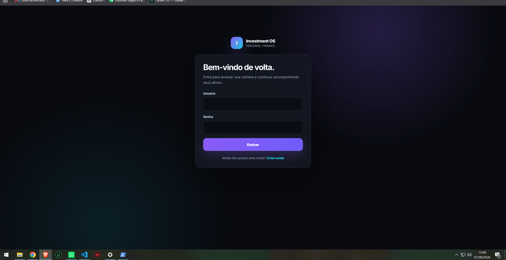
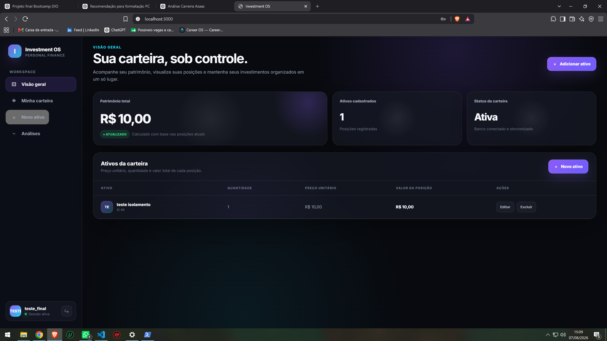
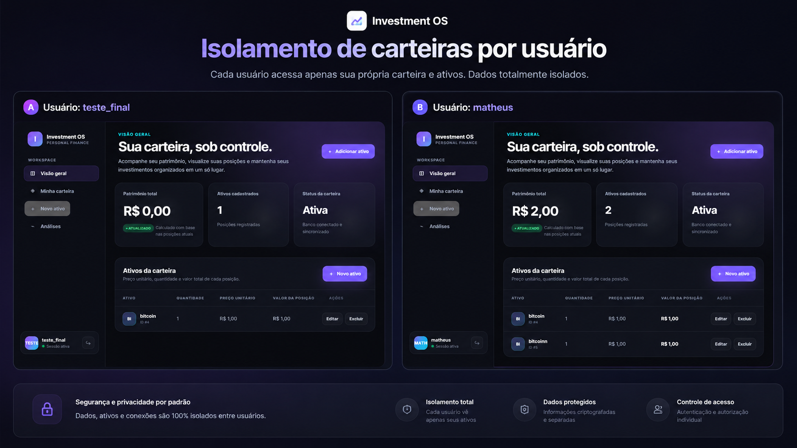

# Investment OS

Aplicação fullstack para gerenciamento de uma carteira de investimentos, desenvolvida em Rust como evolução do projeto final do Bootcamp DIO.

O sistema permite criar uma conta, autenticar-se e administrar ativos em uma carteira individual. Cada usuário possui dados isolados, e nenhuma conta consegue visualizar, editar ou excluir ativos pertencentes a outra.

## Screenshots

### Login e autenticação



### Dashboard da carteira



### Isolamento de carteiras por usuário

Cada conta acessa somente os ativos vinculados ao próprio usuário.



## Principais funcionalidades

- cadastro, login e logout;
- autenticação com JWT armazenado em cookie `HttpOnly`;
- hash seguro de senhas;
- carteiras independentes por usuário;
- cadastro, listagem, edição e exclusão de ativos;
- cálculo automático do valor de cada posição e do patrimônio total;
- validação de nomes, valores, quantidades e duplicidades;
- API JSON protegida por autenticação;
- dashboard responsivo com feedback visual e animações;
- migrations SQL versionadas;
- testes Rust de CRUD, resumo, validações e isolamento entre usuários;
- suíte end-to-end com Playwright em desktop e mobile.

## Tecnologias

- Rust 2024
- Axum
- Askama
- SQLx
- PostgreSQL
- Tokio
- Docker Compose
- JWT
- Argon2 por meio da biblioteca `password-auth`
- Playwright
- HTML, CSS e JavaScript sem framework

## Arquitetura

```text
Navegador
   |
   |-- páginas Askama e formulários
   `-- API JSON /api
            |
            v
       Rotas Axum
            |
            |-- autenticação JWT
            |-- validações
            `-- Repository
                    |
                    v
               PostgreSQL
```

A coluna `user_id` relaciona cada ativo ao proprietário. As consultas de leitura, atualização e exclusão sempre incluem o usuário autenticado.

## Segurança aplicada

- segredos carregados por variáveis de ambiente;
- `.env` ignorado pelo Git;
- senhas armazenadas apenas como hash;
- token com expiração;
- cookie `HttpOnly` e `SameSite=Lax`;
- opção `Secure` para ambientes HTTPS;
- mensagens públicas sem detalhes internos do banco;
- proteção contra acesso cruzado entre carteiras;
- índice único de nome do ativo por usuário;
- validação também na API, não apenas no navegador.

> Este é um projeto educacional e de portfólio. Para uma operação financeira real ainda seriam necessários, entre outros itens, HTTPS obrigatório, proteção CSRF dedicada, rate limiting, observabilidade, recuperação de senha e auditoria de segurança independente.

## Pré-requisitos

- Git
- Rust e Cargo
- Docker Desktop
- `sqlx-cli`
- Node.js e npm para os testes E2E
- VS Code, opcional

Instalação do SQLx CLI:

```powershell
cargo install sqlx-cli --no-default-features --features postgres
```

## Configuração

Clone o repositório e entre na pasta:

```powershell
git clone https://github.com/HanzSolo66/investment-os.git
cd investment-os
```

Crie o arquivo `.env` a partir do exemplo:

```powershell
Copy-Item .env.example .env
```

No `.env`, substitua os valores de exemplo por segredos longos e aleatórios.

Em desenvolvimento local:

```env
COOKIE_SECURE=false
```

Em produção com HTTPS:

```env
COOKIE_SECURE=true
```

## Executar no Windows

O script de desenvolvimento inicia o Docker quando necessário, sobe o PostgreSQL, aguarda o banco ficar pronto, aplica as migrations e inicia a aplicação:

```powershell
powershell.exe -NoProfile -ExecutionPolicy Bypass -File .\scripts\start-dev.ps1
```

Acesse:

```text
http://localhost:3000
```

## Execução manual

```powershell
docker compose up -d
sqlx migrate run
cargo run
```

## Verificação de qualidade

Verificações Rust:

```powershell
powershell.exe -NoProfile -ExecutionPolicy Bypass -File .\scripts\quality-check.ps1
```

Testes end-to-end:

```powershell
npm install
npx playwright install chromium
npm run test:e2e
```

A suíte Playwright cobre 7 cenários:

- acesso sem sessão redirecionado para login;
- cadastro, dashboard e CRUD completo;
- logout e proteção do dashboard;
- isolamento de carteiras entre usuários;
- login em viewport mobile;
- cadastro em viewport mobile;
- dashboard responsivo em viewport mobile.

Na revisão final do projeto, os 7 cenários E2E foram aprovados.

## API

Todas as rotas abaixo exigem uma sessão válida.

| Método | Rota | Finalidade |
|---|---|---|
| `GET` | `/api/assets` | Lista os ativos do usuário |
| `POST` | `/api/assets` | Cria um ativo |
| `PATCH` | `/api/assets` | Atualiza um ativo |
| `DELETE` | `/api/assets/{id}` | Exclui um ativo |
| `GET` | `/api/portfolio/summary` | Retorna o resumo da carteira |

Exemplo de criação:

```json
{
  "name": "Bitcoin",
  "unit_value": 350000.0,
  "quantity": 0.01
}
```

## Estrutura principal

```text
docs/screenshots/        imagens do projeto
e2e/                     testes end-to-end com Playwright
migrations/              alterações versionadas do banco
scripts/                 automações de execução e qualidade
src/auth/                autenticação e sessão
src/routes/api.rs        API JSON e testes
src/routes/frontend.rs   páginas, formulários e dashboard
src/repository.rs        acesso ao PostgreSQL
templates/               interfaces Askama
compose.yml              PostgreSQL local
```

## Decisões técnicas

- O projeto mantém backend e frontend na mesma aplicação Rust.
- SQLx faz validação das consultas em tempo de compilação.
- O banco impõe a unicidade do nome do ativo dentro de cada carteira.
- A autorização é aplicada no acesso aos dados, não apenas na interface.
- O dashboard não depende de frameworks JavaScript externos.
- Playwright valida os fluxos críticos da aplicação no navegador.

## Evoluções futuras

- usar `NUMERIC/DECIMAL` em vez de `DOUBLE PRECISION` para valores monetários;
- adicionar categorias e tipos de ativos;
- histórico de movimentações;
- rentabilidade e gráficos;
- integração com cotações;
- recuperação de senha;
- paginação e filtros;
- deploy com HTTPS e pipeline de CI.

## Apresentação em entrevista

> Desenvolvi uma aplicação fullstack de carteira de investimentos em Rust. Usei Axum no backend, Askama na interface, SQLx com PostgreSQL e Docker para o ambiente. Implementei autenticação, CRUD completo, cálculo do patrimônio e isolamento de dados entre usuários. Também criei migrations, validações, testes Rust e uma suíte end-to-end com Playwright para validar os fluxos críticos em desktop e mobile.

## Origem

Projeto desenvolvido a partir do repositório-base do desafio da Digital Innovation One e expandido com interface própria, autenticação reforçada, isolamento de dados, validações, testes automatizados e automações de desenvolvimento.
